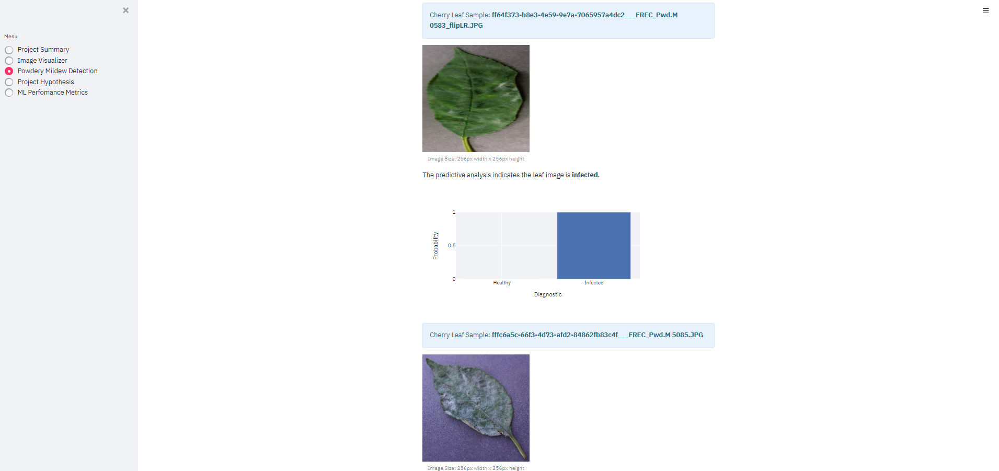

# Cherry Leaf Disease Detection

## Introduction

Farmy & Foods is currently facing a significant challenge with powdery mildew, a common fungal disease that affects their cherry plantations. The existing manual inspection process to detect the disease is not only time-consuming and labor-intensive but also impractical to scale across thousands of cherry trees spread over multiple farms. To address this, we propose an automated solution using machine learning, specifically a Convolutional Neural Network (CNN), to classify cherry leaf images as healthy or diseased. This approach aims to enhance efficiency, reduce costs, and maintain the quality of cherry crops. Moreover, this solution can potentially be adapted to manage diseases in other crops, further strengthening the company's agricultural management strategies.

## Objective

The goal of this project is to develop a machine learning model capable of automatically detecting powdery mildew on cherry leaves from images, replacing the current manual inspection process. By deploying a CNN-based model, we aim to quickly and accurately identify diseased leaves, thereby reducing the time and labor costs involved in manual inspections. This will help Farmy & Foods maintain high-quality standards for their cherry crops and could be expanded to other crops, improving overall disease management across the company.

## Dataset Content

- The dataset is sourced from [Kaggle](https://www.kaggle.com/codeinstitute/cherry-leaves).
- The dataset contains +4 thousand images taken from the client's crop fields. The images show healthy cherry leaves and cherry leaves that have powdery mildew, a fungal disease that affects many plant species. The cherry plantation crop is one of the finest products in their portfolio, and the company is concerned about supplying the market with a compromised quality product.

## Business Requirements

The cherry plantation crop from Farmy & Foods is facing a challenge where their cherry plantations have been presenting powdery mildew. Currently, the process is manual verification if a given cherry tree contains powdery mildew. An employee spends around 30 minutes in each tree, taking a few samples of tree leaves and verifying visually if the leaf tree is healthy or has powdery mildew. If there is powdery mildew, the employee applies a specific compound to kill the fungus. The time spent applying this compound is 1 minute. The company has thousands of cherry trees located on multiple farms across the country. As a result, this manual process is not scalable due to the time spent in the manual process inspection.

To save time in this process, the IT team suggested an ML system that detects instantly, using a leaf tree image, if it is healthy or has powdery mildew. A similar manual process is in place for other crops for detecting pests, and if this initiative is successful, there is a realistic chance to replicate this project for all other crops. The dataset is a collection of cherry leaf images provided by Farmy & Foods, taken from their crops.

- 1 - The client is interested in conducting a study to visually differentiate a healthy cherry leaf from one with powdery mildew.
- 2 - The client is interested in predicting if a cherry leaf is healthy or contains powdery mildew.

## Hypothesis and Validation

### Hypothesis 1: Visual Differentiation of Healthy and Infected Leaves: Validation through EDA, Feature Extraction, and Model-Based Visualizations
Cherry leaves affected by powdery mildew can be identified by distinct visual markers that differentiate them from healthy leaves. A common indicator of this fungal infection is the presence of a thin, white or greyish powdery layer on the leaf surfaces. As the mildew spreads, these powdery patches may increase in size and density, potentially leading to leaf damage and reduced plant vitality. Advanced detection methods, including machine learning algorithms, can help in accurately distinguishing between infected and non-infected leaves.

### *Validation*: Validated through Exploratory Data Analysis (EDA), feature extraction, and model-based visualizations.
An image collage showcases the distinctive whitish spots that appear on leaves affected by a powdery mildew fungal infection. The collage includes a variety of images: some depict the average appearance of infected leaves, others display the variability among different instances of the infection, and additional images illustrate the contrasts between the average infected and healthy leaves. By carefully analyzing these images, clear patterns and differences become apparent, allowing for a more precise identification and distinction between infected and healthy foliage. This visual comparison highlights the consistent characteristics of powdery mildew, facilitating early detection and effective management of the disease.

### Hypothesis 2: Predicting Leaf Health Status Using CNN, Validation through Model Training, Evaluation Metrics, and Real-World Testing
Accurately classifying the health status of a leaf based on its visual characteristics is vital for early disease detection and effective management of plant health. This process is especially important in agriculture, where timely identification of diseases can prevent significant crop loss and ensure food security. In this study, a Convolutional Neural Network (CNN) was developed and trained to predict whether a cherry leaf is healthy or affected by powdery mildew, a common fungal disease. The CNN model was trained using a dataset of cherry leaf images, allowing it to learn and identify distinct visual patterns associated with healthy leaves and those showing signs of powdery mildew. By leveraging deep learning techniques, the model aims to provide a reliable and automated approach for monitoring plant health, potentially aiding farmers and agronomists in taking prompt action to control the spread of the disease and optimize crop yield.

### *Validation*
The CNN model was trained on a well-structured dataset of cherry leaf images, which included a balanced representation of both healthy leaves and those affected by powdery mildew. The dataset was carefully curated to include various stages of disease progression, lighting conditions, and angles to ensure robust model performance. During training, the model achieved high accuracy on both the validation and test datasets, demonstrating its ability to generalize effectively to new, unseen data.

The model's performance was rigorously evaluated using several metrics, including accuracy, loss and classification reports. These metrics provided a comprehensive understanding of the model’s ability to correctly classify both healthy and infected leaves. 
The confusion matrix, in particular, highlighted the model’s precision in distinguishing between true positives (correctly identified infected leaves) and true negatives (correctly identified healthy leaves), as well as its ability to minimize false positives and false negatives.

The high performance across these metrics indicates that the model is highly effective in distinguishing between healthy and infected leaves, thereby confirming the initial hypothesis that a CNN could be used for reliable disease detection. These results suggest that the model can serve as a valuable tool in agricultural settings for the early detection and management of powdery mildew in cherry orchards, potentially reducing the reliance on manual inspection and improving overall crop health monitoring. 

## Mapping Business Requirements to Data Visualizations and ML Tasks

### Business Requirement 1:

- As a user, I want to effortlessly navigate through an interactive dashboard to view and interpret the data presented.
- As a user, I need to see an image collage displaying either healthy or powdery mildew-infected cherry leaves, allowing me to visually distinguish between them.
- As a user, I want to view and toggle between visual graphs showing average images (and differences between averages) as well as image variability for both healthy and mildew-affected cherry leaves, helping me to recognize the visual markers indicative of leaf quality.

### Business Requirement 2:

- As a user, I want to utilize a machine learning model to receive a classification prediction for a provided image of a cherry leaf.
- As a user, I need the ability to input new raw data on a cherry leaf, clean it, and then run it through the provided model.
- As a user, I want to upload the cleaned data to the dashboard so the model can process it and immediately determine if the cherry leaf is healthy or infected with powdery mildew.
- As a user, I want to save the model's predictions in a CSV file with timestamps so that I can maintain a record of all predictions made.

## ML Business Case

* The objective is to create a machine learning tool that can effectively and precisely identify whether a cherry leaf is healthy or affected by powdery mildew, thereby improving the efficiency of inspections and enhancing labor quality.

* A dataset provided by the client will be utilized to train this ML tool, which aims to accurately distinguish between healthy leaves and those infected with mildew.

* The client also requires a user-friendly interface that facilitates the quick uploading of leaf images and achieves at least 97% accuracy in determining the health status of each leaf.

* To maintain the confidentiality of proprietary information, suitable measures will be taken to secure customer data.

* The success of this ML tool will be evaluated based on its accuracy and efficiency in detecting infected leaves, as well as its capacity to decrease the time and costs linked to manual inspections.

* Additionally, the ML tool could be expanded to assess the success of powdery mildew treatments by determining whether the treated leaves have returned to a healthy state.

* There is also potential for the ML tool to be adapted for other crops, particularly those requiring pest detection, to further enhance the efficiency and precision of inspection processes.

* The performance of the ML tool will be validated by training and testing the model on a dataset of cherry leaf images labeled as either healthy or infected with powdery mildew, and its effectiveness will be measured using relevant metrics like accuracy or the F1 score.

* The criteria for the model's success include:

  * Demonstrating the ability to visually differentiate between healthy cherry leaves and those with powdery mildew.
  * Accurately predicting whether a cherry leaf is healthy or infected.
  * Achieving over 90% accuracy on test data.

## CRISP-DM Framework for Cherry Leaf Disease Detection
To effectively guide the machine learning process, we adopt the **Cross-Industry Standard Process for Data Mining (CRISP-DM)** framework, which provides a structured approach across six phases: Business Understanding, Data Understanding, Data Preparation, Modeling, Evaluation, and Deployment.

### 1. Business Understanding
**Objective:** Align machine learning efforts with Farmy & Foods' goal of automating disease detection to save time and reduce costs associated with manual inspections.

**Project Background:**
Farmy & Foods currently employs a manual process to detect powdery mildew, which is not scalable due to the large number of cherry trees.
An automated solution using machine learning is required to streamline this process.

**Business Objectives:**
- Rapid and accurate detection of powdery mildew in cherry leaves to reduce labor costs and prevent crop quality degradation.

**Success Criteria:**
- A machine learning model with at least 97% accuracy in identifying healthy and diseased leaves.
- The model should be deployed in an accessible format for real-time use by field workers.

### 2. Data Understanding
**Objective:** Acquire and explore the dataset to understand the nature of the data and any quality issues.

**Data Collection:**
- The dataset consists of over 4,000 cherry leaf images sourced from Farmy & Foods' crop fields.
- Images are divided into two categories: healthy and those affected by powdery mildew.

**Data Exploration:**
- Perform initial analysis with statistical summaries and visualizations.
- Understand the distribution of classes and detect any anomalies or data quality issues.

**Data Quality Verification:**
- Check for missing or mislabeled images, inconsistent dimensions, or image quality issues that could affect model training.

### 3. Data Preparation
**Objective:** Prepare a clean and structured dataset suitable for modeling.

**Data Cleaning:**
- Remove any corrupted images or those that do not meet quality standards required for accurate modeling.

**Data Transformation:**
- Resize images to a uniform dimension.
- Normalize pixel values.
- Perform data augmentation techniques (e.g., rotation, flipping) to improve model robustness.

**Data Splitting:**
- Split the dataset into training, validation, and test sets to ensure reliable model evaluation and prevent overfitting.

### 4. Modeling
**Objective:** Develop machine learning models to predict the health status of cherry leaves.

**Model Selection:**
- Choose a Convolutional Neural Network (CNN) architecture suitable for image classification tasks.

**Model Training:**
- Train the CNN using the prepared dataset.
- Experiment with different hyperparameters (e.g., learning rate, batch size, number of epochs) to optimize performance.

**Model Testing:**
- Validate model performance using the test set to evaluate its generalization capabilities.

### 5. Evaluation
**Objective:** Assess the model's performance against business and technical objectives.

**Model Evaluation Metrics:**
- Evaluate the model using metrics such as accuracy, precision, recall, F1-score, and confusion matrix to ensure it meets the required performance standards.

**Business Relevance:**
- Confirm that the model can achieve the desired accuracy and efficiency to be a viable replacement for manual inspection processes.

**Iterative Refinement:**
- Based on evaluation outcomes, refine the model by revisiting the data preparation or modeling steps to enhance performance.

### 6. Deployment
**Objective:** Implement the model in a real-world setting for practical use by Farmy & Foods.

**Deployment Strategy:**
- Deploy the trained model on a cloud platform like Heroku to allow for real-time predictions accessible through a user-friendly interface.

**Integration with Business Processes:**
- Ensure the deployment pipeline aligns with existing workflows for disease management, allowing seamless integration for field workers.

**Monitoring and Maintenance:**
- Establish monitoring processes to track model performance over time.
- Retrain the model periodically with new data to maintain accuracy.

## Dashboard Design

The dashboard provides the following features:

- **Upload Image**: A widget to upload a leaf image for prediction.

- **Prediction Result**: A section displaying the model's prediction (healthy or powdery mildew).

- **Visualizations**: Interactive charts and graphs showing the distribution of healthy and diseased leaves, model accuracy, and other relevant metrics.

- **Feedback Section**: A form allowing users to provide feedback on the model's performance.

- **Navigation Menu**: Buttons to navigate between different sections of the dashboard.

**1. Summary Page**
The Project Summary Page offers crucial information about the project's background, such as its origin and the customer who commissioned it. It outlines the business requirements set forth by the customer, which establish the criteria for the project's success. Furthermore, the page details the project's goals and the methods to be employed in reaching them.

**2. Image Visualizer**
The ImageVisualizer page addresses the project's initial Data Analysis business goal. It includes plots that can be conveniently displayed or hidden using the built-in toolbar.
This app page also features a tool for creating image montages, allowing the user to choose a label class to display a montage. This montage is created using a graphical presentation of random images from the validation set.

**3. Powdery Mildew Detection**
The Powdery Mildew Detection tool offers a downloadable dataset of cherry leaf images, both infected and uninfected, for live predictions on Kaggle. The user interface features a file uploader that enables users to upload multiple cherry leaf images. Upon uploading, the system displays the image, a bar chart of the predicted result, and a statement indicating whether the leaf is infected with powdery mildew, along with the probability score. Additionally, a table lists the image names and corresponding prediction results. There is also a download button to save the report as a .csv file, and a link to the Readme.md file for more information about the project.

**4. Project Hypothesis**
The Hypothesis page presents the two hypotheses and the project's outcome goals, along with the success metrics.

**5. ML Performance Metrics**
The ML Prediction Metrics page provides a summary of the machine learning model's performance in predicting whether cherry leaves are infected with powdery mildew. It includes visualizations of label distribution across training, validation, and test sets, and outlines the model’s accuracy and loss during training, demonstrating effective learning and minimal overfitting. The page also presents the model's high accuracy and low loss on the test set, indicating strong generalization to new data. Additionally, key metrics such as loss and accuracy are explained, providing insights into their significance in evaluating and optimizing the model’s performance.

## ML Model Justification

## Unfixed Bugs

At the time of deployment, some bugs related to the image upload functionality and real-time prediction display remain unfixed. These issues stem from limitations in the library used for image processing and the asynchronous handling of requests in the web framework. Future updates will focus on addressing these bugs as more advanced libraries and solutions become available..

## Deployment

### Heroku

- The App live link is: `https://YOUR_APP_NAME.herokuapp.com/`
- Set the runtime.txt Python version to a [Heroku-20](https://devcenter.heroku.com/articles/python-support#supported-runtimes) stack currently supported version.
- The project was deployed to Heroku using the following steps.

1. Log in to Heroku and create an App
2. At the Deploy tab, select GitHub as the deployment method.
3. Select your repository name and click Search. Once it is found, click Connect.
4. Select the branch you want to deploy, then click Deploy Branch.
5. The deployment process should happen smoothly if all deployment files are fully functional. Click the button Open App on the top of the page to access your App.
6. If the slug size is too large, then add large files not required for the app to the .slugignore file.

## Main Data Analysis and Machine Learning Libraries

The following libraries were used in the project:
- **TensorFlow/Keras**: Used for building and training the Convolutional Neural Network (CNN).
  - Example: `model = keras.Sequential([...])`
- **OpenCV**: Used for image processing and augmentation.
  - Example: `img = cv2.imread(image_path)`
- **Matplotlib and Seaborn**: Used for creating visualizations and plots.
  - Example: `plt.imshow(image)`
- **NumPy and Pandas**: Used for data manipulation and analysis.
  - Example: `data = pd.read_csv('data.csv')`

## Credits

### Content

- The text for the Home page was taken from Wikipedia Article A.
- Instructions on how to implement form validation on the Sign-Up page were taken from [Specific YouTube Tutorial](https://www.youtube.com/).
- The icons in the footer were taken from [Font Awesome](https://fontawesome.com/).

### Media

- The photos used on the home and sign-up page are from This Open-Source site.
- The images used for the gallery page were taken from this other open-source site.

## Acknowledgements (optional)

- Thank the people who provided support throughout this project.
